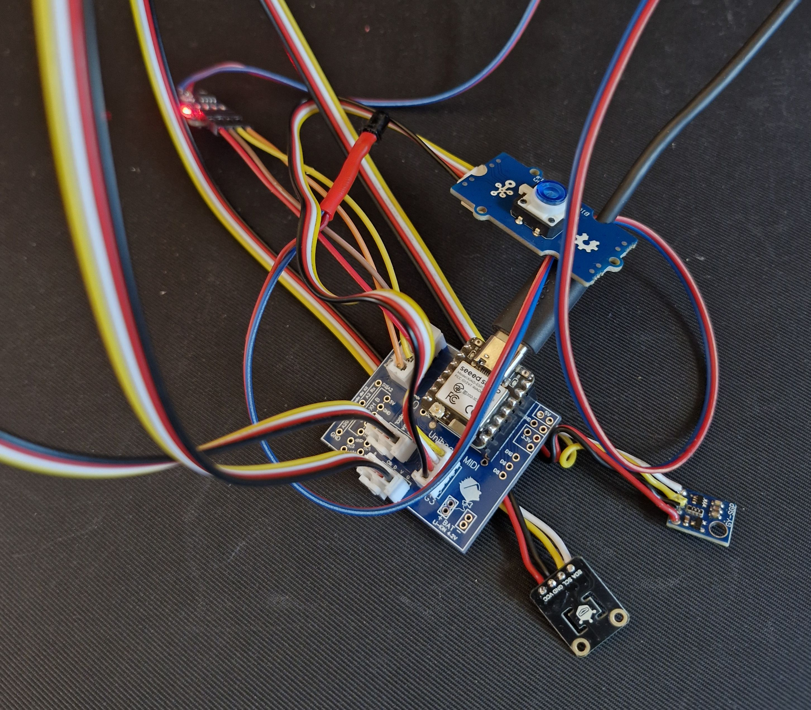

# ESP32C6 StoveSmoke Detector 🍳🔥

  

Inteligentny czujnik bezpieczeństwa do kuchni oparty na układzie **Seeed Studio XIAO ESP32-C6**. Urządzenie monitoruje obecność płomienia, lotne związki organiczne (VOC), temperaturę oraz wilgotność, komunikując się natywnie przez stos **Zigbee 3.0**.

## ✨ Główne Funkcje

* **Wykrywanie Płomienia:** Podwójny odczyt (analogowy poziom natężenia oraz cyfrowy sygnał alarmowy).
* **Cyfrowy Nos (SGP40):** Monitorowanie jakości powietrza i wykrywanie dymu/przypaleń (VOC).
* **Dynamiczny Próg Alarmu:** Regulacja czułości sensora SGP40 za pomocą suwaka w Zigbee2MQTT (zakres 0-60000).
* **Pomiar SHTC3:** Precyzyjne dane o temperaturze i wilgotności powietrza.
* **Niskie Opóźnienia:** Dzięki natywnej obsłudze Zigbee na ESP32-C6, alarmy są przesyłane niemal natychmiastowo.
* **Wielokanałowość:** Wykorzystanie 6 endpointów Zigbee dla przejrzystej prezentacji danych.

## 🛠 Lista Komponentów

1.  **Mikrokontroler:** Seeed Studio XIAO ESP32-C6.
https://wiki.seeedstudio.com/xiao_esp32c6_getting_started/
2.  **Sensor Gazów:** Sensirion SGP40 (I2C).
3.  **Sensor Temp/Hum:** DFRobot SHTC3 (I2C).
4.  **Sensor Płomienia:** Standardowy czujnik podczerwieni (IR) z wyjściem analogowym (A0) i cyfrowym (D1).
5.  **Płytka:** Projekt dedykowany pod Uniboard MIDI.

## 📐 Struktura Endpointów Zigbee

Urządzenie prezentuje się w sieci jako zestaw 6 punktów końcowych:
- **EP1 (Illuminance):** Surowy odczyt analogowy czujnika płomienia.
- **EP2 (Illuminance):** Surowy odczyt VOC z sensora SGP40.
- **EP3 (Binary Input):** Status alarmu ognia (ON/OFF).
- **EP4 (Binary Input):** Status alarmu dymu (na podstawie progu).
- **EP5 (Analog Output):** Suwak do sterowania progiem alarmu (`sgp_threshold`).
- **EP6 (Temp/Hum):** Połączony odczyt temperatury i wilgotności.

## 🚀 Instalacja i Konfiguracja

### 1. Arduino IDE
Upewnij się, że masz zainstalowane wsparcie dla płytek ESP32 (wersja 3.x z obsługą C6) oraz następujące biblioteki:
- `SensirionI2CSgp40`
- `DFRobot_SHTC3`
- `Zigbee` (wbudowana w pakiet ESP32 od Espressif)

### 2. Zigbee2MQTT (External Converter)
Aby urządzenie było poprawnie rozpoznawane, dodaj plik `XIAO-C6-StoveSmoke.js` (dostępny w repozytorium) jako [External Converter](https://www.zigbee2mqtt.io/advanced/support-new-devices/01_support_new_devices.html#static-external-converter) w swojej instancji Zigbee2MQTT.

**Kluczowe ustawienie w Z2M:**
Po sparowaniu urządzenia, jeśli wartości temperatury lub wilgotności nie pojawiają się od razu, wykonaj komendę `Reconfigure` w panelu Zigbee2MQTT.

## 🔧 Użytkowanie

* **Parowanie:** Przytrzymaj przycisk przez 10 sekund, aby zresetować urządzenie do ustawień fabrycznych i wprowadzić je w tryb parowania (LED zacznie migać).
* **Ustawianie progu:** W panelu Zigbee2MQTT znajdziesz suwak "Próg Alarmu SGP". Domyślna wartość to 20000. Jeśli sensor jest zbyt czuły, zwiększ wartość. Jeśli reaguje zbyt późno, zmniejsz ją.
* **Kalibracja:** Sensor SGP40 potrzebuje ok. 24h pracy (burn-in), aby ustabilizować odczyty po montażu i lakierowaniu płytki.

## 📄 Licencja

Projekt udostępniony na licencji MIT. Poczuj się swobodnie modyfikując go pod własne potrzeby!
